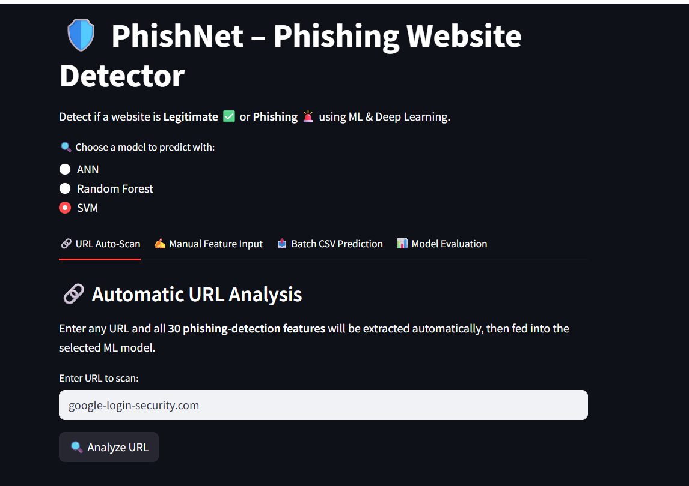
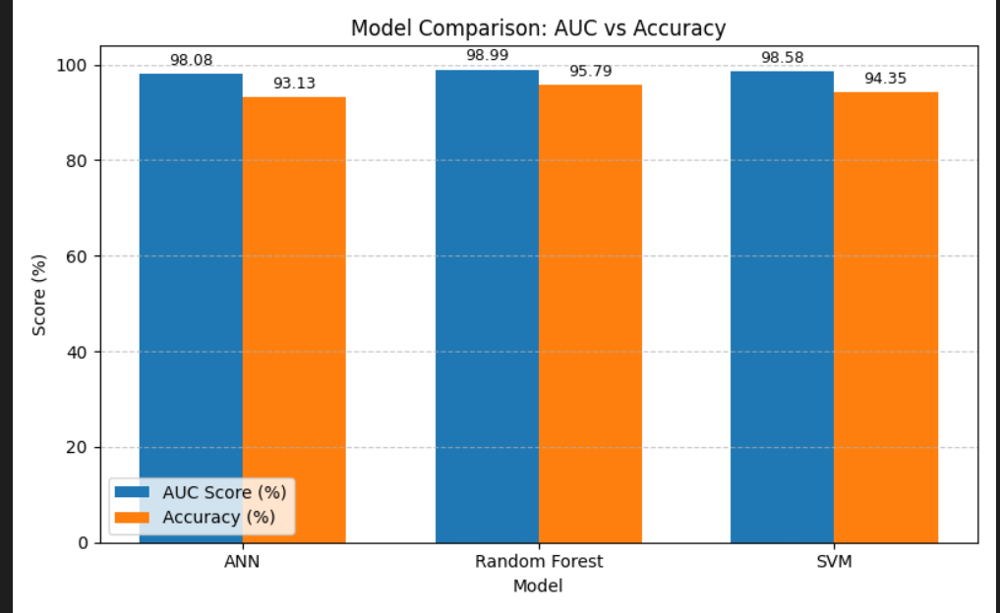
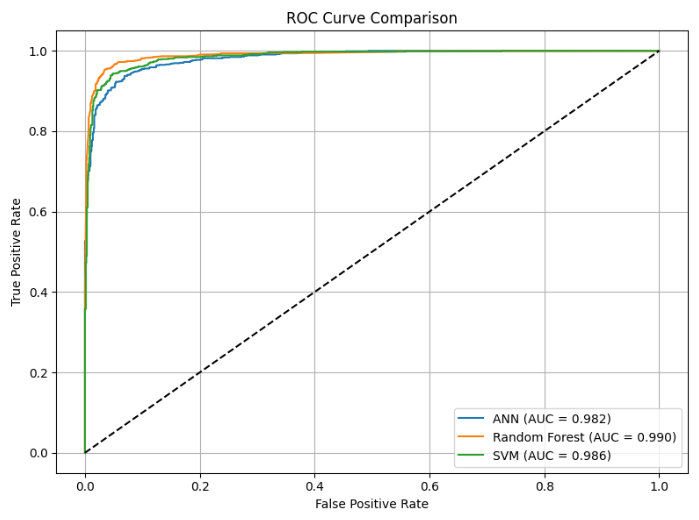

# 🛡️ PhishNet – Phishing Website Detector

> Detect if a website is **Legitimate ✅** or **Phishing 🚨** using ML & Deep Learning.

A production-grade phishing detection system that extracts **30 URL-based features** automatically and runs them through three trained ML models — ANN, Random Forest, and SVM — via a clean Streamlit interface backed by a FastAPI inference engine.

---

## 🚀 Live Application

🎨 **React Frontend:**
👉 [https://phishnet-t8qnh7cszrfv8s6qtwrlln.streamlit.app/](https://phishnet-t8qnh7cszrfv8s6qtwrlln.streamlit.app/)

⚙️ **FastAPI Backend:**
👉 [https://phishnet-t6pj.onrender.com/docs](https://phishnet-t6pj.onrender.com/docs)

---

## 📌 Project Overview

PhishNet is an end-to-end machine learning deployment project that identifies phishing websites in real time. It supports:

- 🔗 **Automatic URL feature extraction** — paste any URL and 30 phishing-detection features are extracted instantly
- 🧠 **Three trained ML models** — ANN, Random Forest, and SVM with high AUC scores
- 🖥️ **Interactive Streamlit UI** — URL scanning, manual feature input, batch CSV prediction, and model evaluation tabs
- ☁️ **Cloud deployment** on Render + Streamlit Cloud

Designed for cybersecurity analysts, IT teams, and end users who need fast, reliable phishing detection without manual feature engineering.

---

## 🖼️ Application Screenshots

### URL Auto-Scan Interface


*Enter any URL and the app automatically extracts all 30 phishing-detection features and runs them through your chosen model.*

---

## 🧩 Features

**🔗 URL Auto-Scan**
Paste any URL to automatically extract 30 phishing-detection features and get an instant prediction from the selected model.

**✍️ Manual Feature Input**
Manually enter feature values for fine-grained control and custom testing scenarios.

**📦 Batch CSV Prediction**
Upload a CSV file with multiple URLs or feature sets and get bulk predictions in one click.

**📊 Model Evaluation**
Explore detailed performance metrics — AUC, accuracy, precision, recall, and F1-score — for all three models side by side.

---

## 🧠 Model Evaluation

All three models were trained and evaluated on a labeled phishing dataset with 30 URL-based features.

### Performance Summary

| Model | AUC Score | Accuracy | Precision | Recall | F1-Score |
|-------|-----------|----------|-----------|--------|----------|
| ANN | 0.9808 | 93.13% | 0.9322 | 0.9457 | 0.9389 |
| Random Forest | **0.9899** | **95.79%** | **0.9568** | **0.9684** | **0.9626** |
| SVM | 0.9858 | 94.35% | 0.9426 | 0.9571 | 0.9498 |

> **Random Forest** achieves the best overall performance with AUC = 0.990 and accuracy of 95.79%.

### AUC vs Accuracy Bar Chart



*All three models achieve AUC > 0.98, indicating excellent discrimination between phishing and legitimate sites.*

### ROC Curve Comparison



*Grouped bar chart comparing AUC Score (%) and Accuracy (%) across all three models.*

---

## 🛠️ Tech Stack

| Category | Tools / Libraries |
|----------|-------------------|
| Machine Learning | Scikit-learn, TensorFlow/Keras (ANN), RandomForest, SVM |
| Feature Engineering | `requests`, `beautifulsoup4`, `python-whois`, `dnspython`, `urllib`, `re`, `ssl`, `socket`, `datetime`, `pandas` |
| Backend API | FastAPI + Uvicorn |
| Frontend UI | Streamlit |
| Caching | Redis |
| Monitoring | Prometheus |
| Deployment | Render, Streamlit Cloud, Docker |

---

## 📐 Feature Extraction

PhishNet extracts **30 phishing-detection features** from any URL automatically using the following libraries:

```bash
pip install requests beautifulsoup4 python-whois dnspython
```

| Library | Purpose |
|---------|---------|
| `re` | Regex-based URL pattern analysis |
| `ssl` | SSL certificate validation checks |
| `socket` | IP address resolution & hostname lookup |
| `requests` | HTTP page fetching & redirect detection |
| `whois` | Domain age & registration info |
| `dns.resolver` | DNS record existence checks |
| `bs4` (BeautifulSoup) | HTML parsing for page-level features |
| `urllib.parse` | URL component decomposition |
| `datetime` | Domain age calculation |
| `pandas` | Feature tabulation & batch processing |

**Features extracted include:**
- URL length, hostname length, number of dots, hyphens, underscores
- Presence of IP address, `@` symbol, `//` redirection
- HTTPS token in domain, subdomain depth
- Domain age, DNS record existence, WHOIS data
- SSL certificate validity
- Presence of favicon, iframe usage, redirect count
- Right-click disabled, mouse-over status bar changes
- And more...

---

## 🌟 Example API Request

```json
POST /predict
{
  "model": "random_forest",
  "features": [1, 0, 1, 0, 1, 0, -1, 1, 0, 1, 0, 0, 1, 1, 0, -1, 1, 0, 1, 0, 0, 1, 1, -1, 0, 1, 0, 1, 0, 1]
}
```

**Response:**
```json
{
  "prediction": "Phishing",
  "confidence": 0.97,
  "model_used": "random_forest"
}
```

---

## 📁 Project Structure

```
PhishNet/
├── app/
│   ├── __pycache__/
│   └── models/
│       ├── ann_model.h5
│       ├── pca.pkl
│       ├── rf_model.pkl
│       ├── scaler.pkl
│       ├── svm_model.pkl
│       └── xgb_model.pkl
├── api/
│   ├── __pycache__/
│   ├── routes_auth.py         # Authentication routes
│   ├── routes_predict.py      # Prediction routes
│   └── routes_predict.py
├── cache/
│   ├── __pycache__/
│   └── redis_cache.py         # Redis caching layer
├── core/
│   ├── __pycache__/
│   ├── config.py
│   ├── dependencies.py
│   ├── exceptions.py
│   └── security.py
├── middleware/
│   ├── __pycache__/
│   └── logging_middleware.py
├── models/
│   ├── __pycache__/
│   └── services/
│       ├── __pycache__/
│       └── main.py
├── data/
│   └── phishing.csv           # Training dataset
├── Frontend/
│   └── frontend.py            # Streamlit frontend
├── notebooks/
│   ├── feature_extraction.ipynb
│   ├── phishing_project.ipynb # Main training notebook
│   └── phishing.csv
├── reports/
│   ├── __init__.py
│   ├── ann_confusion_matrix.png
│   ├── class_distribution.png
│   ├── correlation_heatmap.png
│   ├── feature_value_summary.png
│   ├── model_comparison.png
│   ├── model_summary.png
│   ├── random_forest_confusion_matrix.png
│   ├── roc_curve_comparison.png
│   └── svm_confusion_matrix.png
├── training/
│   ├── train_model.py         # Model training scripts
│   └── train_utils.py
├── Screeshots/
│   ├── phishnet_ui.png        # App UI screenshot
│   ├── roc_curve.png          # ROC curve comparison
│   └── auc_vs_accuracy.png    # AUC vs Accuracy bar chart
├── .dockerignore
├── .env
├── .gitignore
├── docker-compose.yml
├── Dockerfile
├── prometheus.yml
├── README.md
├── render.yaml
└── requirements.txt
```

---

## 🧠 Future Enhancements

- 📌 CI/CD Pipeline with GitHub Actions
- 🐳 Dockerization for containerized deployment
- 🔄 Model retraining pipeline with new phishing data
- 📲 Browser extension for real-time phishing alerts
- 🌐 WHOIS + VirusTotal API integration for deeper URL analysis
- 🔔 Alert system for flagged URLs

---

## 🤝 Contributing

Pull requests are welcome! Feel free to open issues for improvements, bugs, or new feature proposals.

1. Fork the repository
2. Create your feature branch (`git checkout -b feature/AmazingFeature`)
3. Commit your changes (`git commit -m 'Add some AmazingFeature'`)
4. Push to the branch (`git push origin feature/AmazingFeature`)
5. Open a Pull Request

---

## 📄 License

This project is licensed under the MIT License. See the [LICENSE](LICENSE) file for details.

---

<p align="center">Made with ❤️ for a safer web</p>